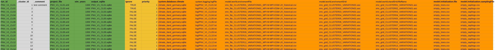

# ilandc-runner

A tool to run a large number of iland runs in parallel (preferrably on a powerful server) with the [iland console application](https://iland-model.org/iLand+console)


## Overview

With this tool you can run multiple iland runs in parallel without needing to create a project file for every run.
In a nutshell you:
- define a general project file that holds all parameters that are the same for all runs
- create a .csv file where you define what is different for every run
- set the ilandc runner settings, specifying how many workers run in parallel and how many threads each worker gets
- then you runs 3 python scripts and wait
- in the meantime you can monitor the progress of each worker via [screen](https://linuxize.com/post/how-to-use-linux-screen/) command or check the log files for progress


---

## Repository Structure
TODO change this here

```
.
├── data/           # Input data
├── scripts/        # Main scripts
├── config/         # Configuration files
├── docs/           # Documentation
├── examples/       # Example workflows
└── README.md
```

---

## Prerequisites & Installation
- make sure to run `python -m pip install -r requirements.txt` (or use whatever python package manager you want) to install the python requirements.
- for multithreading you shoud have `screen` installed. should come preinstalled on linux servers but do `which screen` to confirm

---


## Usage


### Preparing csv tables with excel
- create one or more iLand projects
- in the root folder of the iLand project, you can place a .xlsx or .csv file, where each line defines one run
- please refer to the screen shot for the correct format of the table (also a table like this is provided under `other/test.csv`)
    - green columns: they are compulsory and the program will throw an error if they are not provided
    - orange columns: (optional) these are iland options that should be overwritten for the run; they have to follow the syntax of the iland project file, e.g. project.system.database.climate
         (see [wiki](https://iland-model.org/project+file) for reference)
    - yellow columns: (optional) they change the way the rows are exectuted
        - priority: decide which run is made first; lowest number starts
        - ignore: ignore this run (in case you want to run it later)
    - grey columns: (not processed; name has to start with an underscore) these are ignored by the runner, but might help you when creating the table (through some excel magic)
    - (the colors are only for this explanation, but in your excel file you don't have to color them like this) 

- check the example excel file under `other/example.xlsx`
- excel files can have multiple sheets/tables, they are all loaded automatically
- you can place multiple files in the project root; as long as they end on .xlsx or .csv, they are loaded (if you don't want them to run, you need to place them in a subfolder)
- it is recommended to have a seperate log file (via system.logging.logFile) for each run (like in the screenshot), so that the logs dont overwrite each other on a successive iland simulation with the same project file


### change settings.toml
- take a look at the toml file and change the settings according to their explanations
    - the path to the ilandc executable needs to be defined; this is different for every system
    - you can list multiple iLand projects folders (where your excel tables are placed)
    - you can change the settings, if you want to have multiple workers working in parallel

## Running the simulations
1. make sure you prepared all the files as described in section "Preparing iLand projects"
2. run `python 01_prepare_queue.py` 
    - the script will automatically check if you have already done a simulation (by checking if the output sqlite is already there) and will skip it. if you want to redo it, you need to delete or move the sqlite
    - you can sanity check the produced `instruction_queues/all-commands.sh`. Check if all the runs are there as you specified them with the excel files.
3. run `python 02_prepare_workers.py`
    - this will create a seperate script for each worker in folder `instruction_queues`
    - beware that you should limit the threads per worker in the `settings.toml` if you use multiple workers to not overload your server
4. run `python 03_start_workers.py`
    - this will run the previously created worker scripts each in a seperate screen session; screen makes sure that scripts keep running even if you close your ssh session; you can take a look at the active screen session with `screen -ls`, then attach to a session using `screen -r SESSION_ID` and detach by pressing Ctrl+A+D (more info on screen [here](https://gist.github.com/jctosta/af918e1618682638aa82))
    - while the script is running, the workers will add the commands to either `status/successful-commands.txt` or `status/failed-commands.txt`, depending on if they ran without errors or not
    - recommend check: confirm via `screen -ls` if you actually see the ilandc-workers running; if they are not running and you don't know why, just run e.g. `bash instruction_queues/worker-0.sh` and check the command line output
    - while waiting you can also check the log files and the sqlite results
    - if you have commands in the failed commands either check the log files or run the command individually without the ilandc runner to check what's wrong
    - if at any point you decide that you want to cancel the current run, do the following
        - run "killall screen" (beware that this will kill ALL screen sessions of your user on the server); by killing the screen sessions, the underlying ilandc commands will be canceled as well
        - if you rerun the ilandc runner again now it will skip some files because it sees that a .sqlite file of the corresponding run is already there. So go into your output folder and delete all those .sqlite files that you want to rerun
5. if you want an ETA on when the simulations will be finished, do the following
    - note the time when you started the ilandc runner
    - do "ls -l outputs/*.sqlite | wc -l" to get the number of all finished + currently running ilandc runs
    - calculate your ETA from that
6. do a final check and see if all output sqlites where produced correctly; you can also run `python 01_prepare_queue.py` again and if all results were produced correctly it should skip all of the runs


---


## Common Issues
(none yet)

---


## Contact
Jonas Kerber
-> contact me either via jonas.kerber@tum.de or text me in the Discord channel